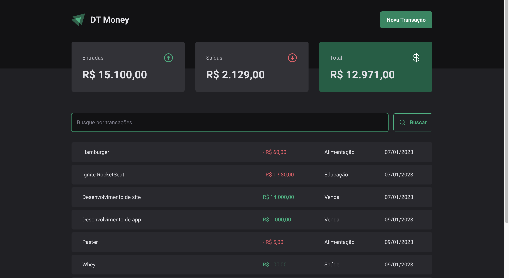

# dt-money

Projeto desenvolvido no curso na trilha de react no curso Ignite da [RocketSeat](https://app.rocketseat.com.br/?).

Projeto que tem por objetivo registro de finanças, sendo possível criar transações, para contabilidade de suas despesas.

## Funcionaldiades 

- Criação de transações
- Exclusão de transações
- Soma de transações

## Bibliotecas usadas

- [ZOD](https://zod.dev/)
- [Styled components](https://styled-components.com/)
- [Phosphor Icons ](https://phosphoricons.com/)
- [React Hook Form](https://react-hook-form.com/)
- [RadixUI](https://www.radix-ui.com/)
- [Axios](https://axios-http.com/ptbr/docs/intro)
- [Use Context Selector](https://www.npmjs.com/package/use-context-selector)

## ScreenShot

